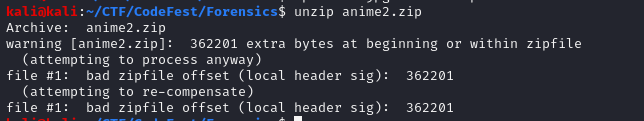
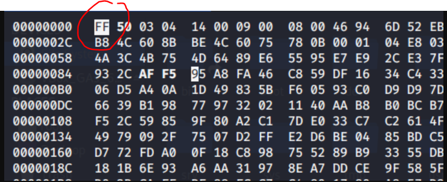
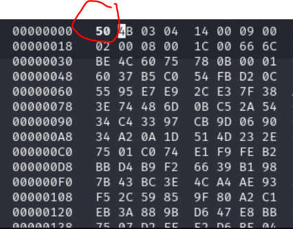
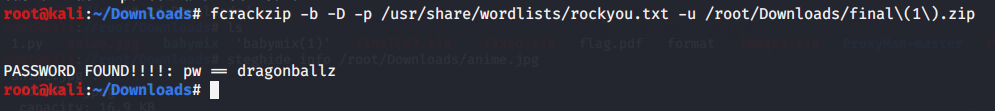
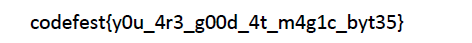

Initailly i tried to use `steghide`

`steghide info /root/Downloads/anime.jpg ` . But it was asking for passphrase that I wasn't getting. 
So I changed it to zip and tried to do something...but no ....!!!!!!!!!

Then 

# Convert it to zip and change this offset 
 `dd if=anime.jpg bs=1 skip=362201 of=final.zip`

 this idea came to mind coz of 

then 
 you neeed to  hexedit it 
 ( I git this idea by seeing similar problems using this approach)

So, **change the first ff to 50**

Now unzip it .

Here i used frackzip to get the password  (dictionary attack)
(p.s- i installed it today only...so was eager to use it tbh.)

`fcrackzip -b -D -p /usr/share/wordlists/rockyou.txt -u /root/Downloads/final\(1\).zip`

**password - dragonballz**

You will find the much requuired `flag.txt`

But opening it wont give you the flag. So I tried to convert it into other forms...coz my initial target was to get this flag.txt

So changed to pdf 

(I have given it here also.)

Unfortunately again it asks for password...damn!!! 

But now I remember that i used aperisolver and found out 

[+] COMMON PASSWORD(S) : naruto, , PKNjo

so just tried out this...and it worked. 

Open the pdf with `naruto`

You see the flag now. 

