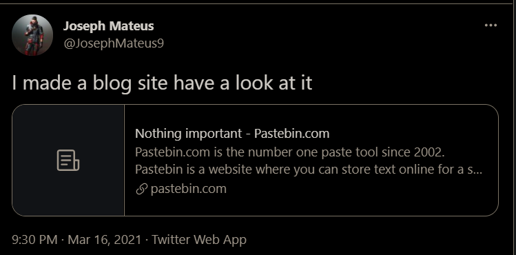
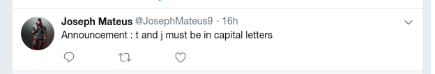
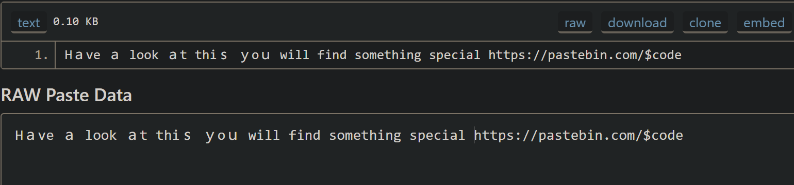
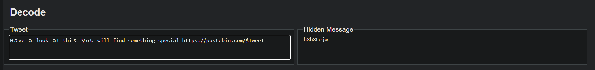
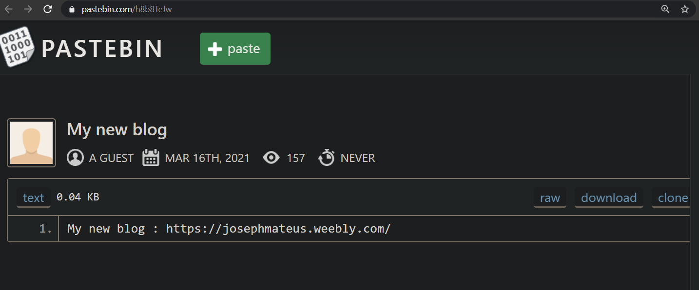
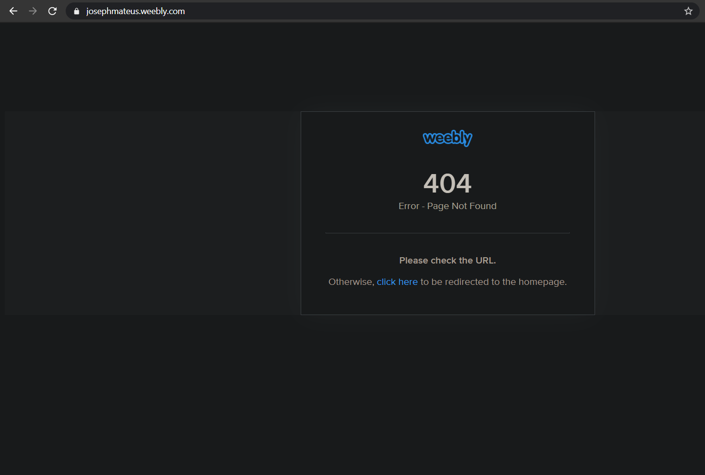

ok... first thing the `@` gives us idea about someone's twitter account. 

So you have it easily.

https://twitter.com/JosephMateus9/status/1371853893345423361

and the link is 

https://pastebin.com/ngwg3rXT

But for safety, there is something more to look about to get to know about past tweets. 

use `Waybackmachine`

You have

https://web.archive.org/web/20210317074340/https://twitter.com/JosephMateus9

Now opening the pastebin link....

https://pastebin.com/$code

*here is a important observation....if you catch.. you should be happy...else simply convert to ascii.*

72 239 189 129 118 101 226 128 135 239 189 129 32 108 206 191 206 191 107 226 128 131 239 189 129 116 226 128 135 116 104 209 150 239 189 147 226 128 131 239 189 153 111 239 189 149 226 128 134 119 105 108 108 32 102 105 110 100 32 115 111 109 101 116 104 105 110 103 32 115 112 101 99 105 97 108 32 104 116 116 112 115 58 47 47 112 97 115 116 101 98 105 110 46 99 111 109 47 36 99 111 100 101
and `ASCII to text`

Hａve ａ lοοk ａt thіｓ ｙoｕ will find something special https://pastebin.com/$tweet
here is a twist. I searched a lot to decode it. And then found out 

https://holloway.nz/steg/

Now this gives some hint to repace `code` in that link by `h8b8tejw             `

But dont forget to change `t` and `j` to `T` and `J`

So https://pastebin.com/h8b8tejw -> https://pastebin.com/h8b8TeJw

So now you have the actual blog link. 

https://josephmateus.weebly.com/

**Dont be happy...it isn't done yet...!!!**

So dont forget `Waybackmachine`

Here you will find out three previous snaps. Hence the flag is present there. 

[The page has been paused after the ctf was over. So could find the flag while writing it.]
