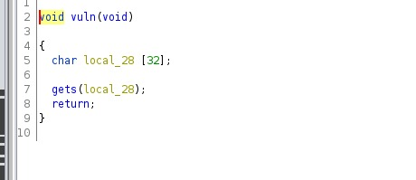
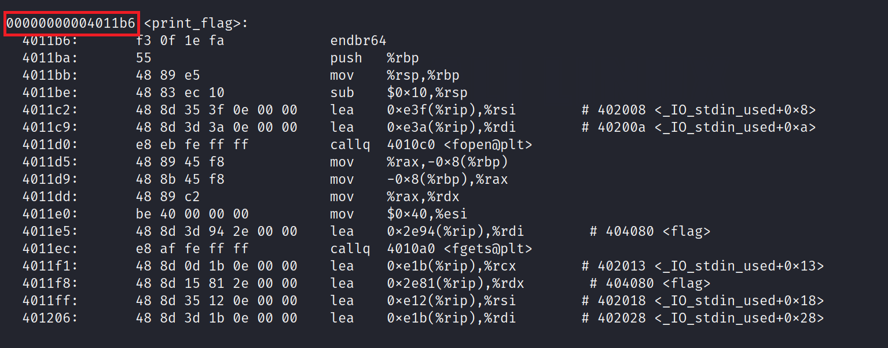

# C is hard  

The pawning question was vulnerable to buffer overflow. 

So i designed the payload to buffer overflow the local_20 char array and the passed the print_flag() function address into the stack to call the print_flag function.

.PNG)

I found out the address of the function print_flag by objdump.

Then i inserted the payload and it worked....yay!!!!

